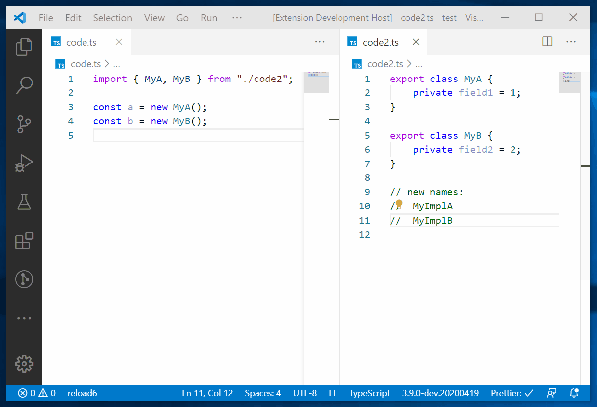

# Multi Cursor Enhancer

This extension provides helper commands for working with multiple cursors.

## Provided Commands

-   **Multi Cursor Enhancer: Multi Rename** (bound to F2). Renames every selected symbol to a matching item. Matching items are extracted from the clipboard and can be edited in a prompt.

    This is incredible useful if combined with other multi cursor features.

    

## Planned Commands (Not Implemented Yet)

-   Extend all selections until a selected character is found (inspired by `yo1dog.multi-cursor-search`).
-   Replace all selections with the result of a javascript function (inspired by `map-replace.js`).
